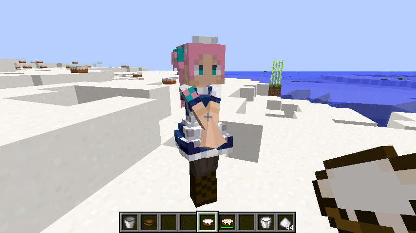

EntityModeMobMilk (モブミルク)
====================

## 概要

littleMaidMob のメイドさんからミルクが採取できるようになる拡張MODです。

## スクリーンショット

## 前提

- Minecraft 1.6.2
- ModLoader 1.6.2
- YMTLib_162v1
- MMM 氏制作の littleMaidMob が必要です。

## 導入

mods に zip のまま放り込んでください。
導入前にバックアップを取るのも忘れずに。".minecraft" 自体をバックアップするのがお手軽です。

## 使い方

「空バケツ」を持ってメイドさんを右クリックすることで牛乳を取ることができます。
「木のボウル」を持ってメイドさんを右クリックすると「ミルクボウル」が取れます。

ミルクボウルは、飲むと状態変化が解消されます。
また具材を投入することで食物アイテム「ミルクシチュー」にすることができます。

## レシピ

### ミルクシチュー　←　ミルクボウル＋具材

具材には「生の鶏肉」「生の豚肉」「生の牛肉」「パン」「ニンジン」「ジャガイモ」「砂糖」が使えます。
作業台にどのように配置しても構いません。具材が多ければ多いほど満腹になります。

注意点：肉類は重複して投入できません。砂糖は他の具材と一緒に投入する必要があります。

## Config (mod_MobMilk.cfg)

    milkStewItemId=2601                     # ミルクボウルとミルクシチューのアイテムID

## 利用条件

この MOD は Apache License(ver2.0) の下で配布されます。

    http://www.apache.org/licenses/LICENSE-2.0

- この MOD を使用したことにより発生したいかなる結果についても、製作者は一切の責任を負いません。
- この MOD は変更の有無にかかわらず再頒布が可能です。Apache License を確認してください。

この MOD または派生成果物は、それが minecraft を前提としている場合に、
minecraft 自体の利用条件に縛られることに注意してください。
利用条件の詳細は minecraft の利用規約を確認してください。

## Copyright 2013 Yamato

Licensed under the Apache License, Version 2.0 (the "License");
you may not use this file except in compliance with the License.
You may obtain a copy of the License at

    http://www.apache.org/licenses/LICENSE-2.0

Unless required by applicable law or agreed to in writing, software
distributed under the License is distributed on an "AS IS" BASIS,
WITHOUT WARRANTIES OR CONDITIONS OF ANY KIND, either express or implied.
See the License for the specific language governing permissions and
limitations under the License.

## History

- 162v1: Minecraft1.6.2に対応しました
- 152v1: Minecraft1.5.2に対応しました
- 151v2: ミルクボウルとミルクシチューを追加しました
- 151v1: 初版
